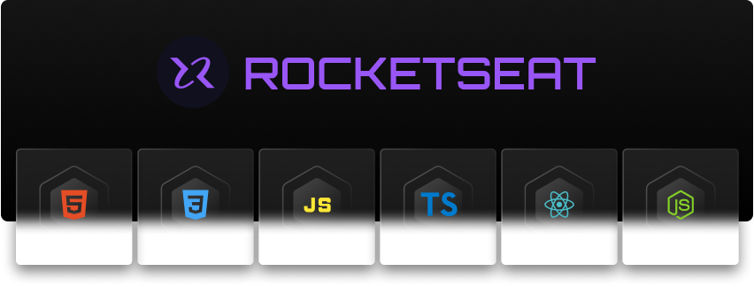

# Rocketseat

# Se aventure no ecossistema JavaScript e desenvolva na prática projetos FullStack

  
  
  
  
  
  
  
  
  
  
  

   

# FullStack: +45hrs

  

    Aprenda desde os fundamentos da programação (Hardware Software, SO, Internet, Client-side, Server-side).  
    Aprenda a configurar o ambiente de desenvolvimento com ferramentas e recursos para programar.  
    <b>GIT & GitHUB:</b> Aprenda versionar projetos em repositórios remotos. Aprenda a fazer deploy do projeto em GitHUB pags.  
    <b>HTML5:</b> Aprenda desde os fundamentos do HTML (TAGS, Estrutura semântica, Atributos e Propriedades, Meta tags, Acessibilidades).  
    <b>CSS3:</b> Aprenda desde os fundamentos do CSS (Estilizar um projeto, Atributos e Propriedades). Avançando com (Flexbox e CSS Grid, Animation e Transition).  
    Aprenda sobre responsividade (mobile-first, Tablet & Desktop).  
    <b>JAVASCRIPT:</b> Aprenda desde os fundamentos da linguagem (Variáveis, Tipos de dados, Funções e Objetos e seus métodos, Selectors de DOM, ES6+, ESNext).  
    <b>TYPESCRIPT:</b> Entenda as vantagens do seperset (Tipagem, Types e Interfaces).  
    <b>NODEJS:</b> Aprenda desde os fundamentos (API RESTful, Banco de dados, MVC).  
    <b>REACTJS:</b> Aprenda desde os fundamentos (Components, States, Hoocks, Contexts).  
  

## PROJETOS

## Página de receitas, Local Turístico, Portfólio, Lista de compras, RocketNotes (Projeto Final)

   

# REACTJS + NEXTJS: +40hrs

  <b>REACTJS: </b> Conheça os tópicos essenciais de REACTJS para web. (Fundamentos do REACTJS, Vite, Components, props, children, states, hooks, custom hooks, renderização condicional, REACTJS Hook Form + Zod, REACTJS Router DOM, Hooks, Custom Hooks, Context API).  
  <b>NEXTJS: </b> Avance com (NEXTJS + TAILWINDCSS, SPA, SSR, SSG, CSR, Rotas com pages).  

## PROJETOS

## Coffee Delivery, Github Blog, Pizza Shop, Ignite Call

   

# NODEJS: +35hrs

  <b>NODEJS: </b> Exploraremos tópicos cruciais para o desenvolvimento robusto de aplicações back-end, do zero até o deploy.  
  Aprenda fazer testes automatizados, SOLID, DDD, .  

## PROJETOS

## Daily Diet API, FindFriend PAI (SOLID), FastFeet Delivery API (DDD)

   
