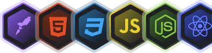

  
  # ROCKETSEAT

# Explorer FullStack - +64hrs

  Continuando a jornada com uma introdução aos principais conceitos: <b>Clent-Side com ReactJS e Styled-components</b> e mais</b>.  

## PROJETOS

## RocketNotes

  Utilizado para guardar links favoritos.  

 

## Stacks

## Back-end

- **BCryptjs:** Lorem.  
- **Cors:** Lorem.  
- **Express:** Lorem.  
- **Express Async Errors:** Lorem.  
- **JSON Webtoken:** Lorem.  
- **Knex:** Lorem.  
- **Multer:** Lorem.  
- **SQLite:** Lorem.  
- **SQLite 3:** Lorem.  

## Front-end

- **Axios:** Lorem.  
- **React:** Lorem.  
- **React Router Dom:** Lorem.  
- **React Icons:** Lorem.  
- **Styled Components:** Lorem.  
- **Eslint:** Lorem.  
- **Vite:** Lorem.  
   
