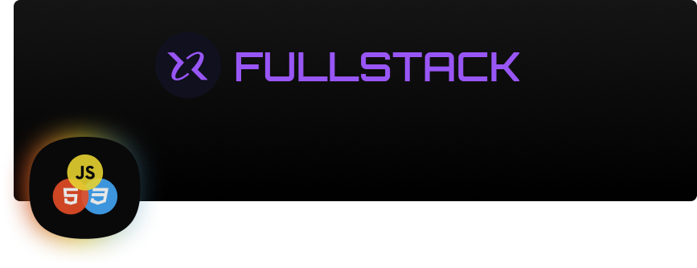

# NodeJS

  
O que é API (Application Programing Interface / Interface de Programação de Aplicação)

  O cliente pede ao garçom um prato, o garçom entrega o pedido para a cozinha, a cozinha prepara o prato e passa para o garçom que por sua vez retorna para o cliente.  
  A API é um intermediário entre o front-end e o back-end, passando e retornando dados e informações.  
  Cliente = Mobile / Desktop / Browser  
  Garçom = API NodeJS  
  Cozinha = Server  

 

  
O que é NodeJS

  É um ambiente que permite escrever e executar aplicações JavaScript no server-side.  
  É utilizado por grandes empresas (Microsoft, Apple, Netflix, Amazon, etc) para desenvolvimento de grandes projetos (API, Scripts e Automação, Back-end, IA, etc).  
  Utiliza V8 Engine (desenvolvido pela Google) para interpretar JS e rodar no server-side.  
  <b>Event Loop</b> É um processo Sigle Thread / Único Porteiro e Non-blocking I-O / Não bloqueia entrada ou saída. Recebe a requisição e envia a função para Call Stack. Conforme as função vão sendo finalizadas, são retornadas pelo Event Loop para que as chamou.  
  Utiliza Módulos / Packages para construir aplicações.  
  <a href="https://nodejs.org/en/download/"><b>Download NodeJS</b></a>

 

  
Iniciando projeto em NodeJS

  <b>npm init -y:</b> Inicia rapidamente um projeto em NodeJS com algumas informações básicas (nome, versão, dependências, scripts, licensa, etc).  

 

  
O que é Express

  É um framework para NodeJS, permite criar servidor da aplicação de forma rápida e segura.  
  Muito utilizado para criar API.  

 

  
O que são Rotas

  É o caminho entre ponto A e ponto B, ou seja, o site deseja acessar algum recurso disponível na aplicação (cadastro, login, produtos, etc).  
  <b>meusite.com/produtos/123:</b> Domínio com end-point.  
  <b>meusite.com:</b> É o dominio principal.  
  <b>/produtos:</b> É uma rota que exibe ua lista de produtos.  
  <b>/123:</b> É um identificador do produto.  
  Toda rota está relacionada com uma funcionalidade que utiliza um dos verbos <b>HTTP</b>.  
  <b>GET:</b> É responsável por requisitar dados.  
  <b>POST:</b> É responsável por adicionar dados.  
  <b>PUT:</b> É responsável por editar conjunto de dados.  
  <b>PATCH:</b> É responsável por editar um dado expecífico.  
  <b>DELETE:</b> É responsável por remover dados.  

 

  
Tipos de requisição

  Existem 3 tipos de parâmetros comumente utilizados.  
  <b>params:</b> Recebe os dados da requisição na rota.  
  Uso: Buscar algo expecífico.  
  EX: <b>meusite.com/users/380327</b>. Pode ser usado com PUT, PATCH, GET, DELETE.  
  <b>query:</b>  Recebe os dados da requisição como parâmetro na URL. Uso: Filtros para consultas na aplicação.  
  EX: <b>meusite.com/products?name=notebook</b>.  
  <b>body:</b> Recebe os dados da requisição no corpo da requisição (FORMs), em um objeto em JSON.  
  Uso: Salvar dados em DBs.  
  EX: <b>{name: 'diogo', role: 'Front-end'}</b>.  

 

  
O que é Controllers

  São classes onde conterão os métodos de processamento e regras de negócio da aplicação.  
  É preciso instanciar onde for utilizar, ou usar métodos estaticos.  

 

  
O que são HTTP Status Code

  Representa o estado da resposta, são agrupados por faixas númericas.  
  <b>100-199:</b> Informativo (A solicitação foi aceita ou em processamento, etc).  
  <b>200-299:</b> Sucesso (Requisição bem sucedida, etc).  
  <b>300-399:</b> Redirecionamento (Movido, movido permanentemente, etc).  
  <b>400-499:</b> Erro no cliente (Bad req, set timeout, não autorizado, não encontrado, etc).  
  <b>500-599:</b> Erro no servidor (Servidor falhou ao concluir a solicitação, erro interno, etc).  

 

  
O que é Middleware

  São funções que ficam entre a requisição do usuário e a resposta da aplicação. Tem acesso a request e response e Next.  
  É como um porteiro, que verifica o ticket dos visitantes e libera ou barra a entrada.  
  EX: Permite que somente usuários admins cadastrem produtos na loja, middleware faz essa verificação e redireciona para cadastro ou login.  

 

  
O que é Banco de Dados

  É uma coleção de diversos tipos de dados (lista de contatos, de compras de convidados, etc). Devem estar organizados por assuntos.  
  Banco de dados é composto por:  
  <b>Banco de Dados:</b> Recebe um nome único. É onde ficaram guardados tabelas e dados.  
  <b>Tabela:</b> Recebe um nome único. É uma forma de organizar os dados por assuntos, os dados são inseridos em tuplas/celula (id, nome, email, password, avatar, etc).  
  <b>Registro:</b> São os dados e seus tipos (varchar, inter, boolean, etc).  
  Banco de dados co tableas que se relacionam são conhecidos como: <b>Banco de Dados Relacional</b>.  

 

  
O que é SQL

  É a linguagem padrão para banco de dados relacional.  
  Utiliza comandos para manipulação dos dados.  
  <b>CREATE:</b> Comando para criar DB ou tabelas.  
  <b>DROP:</b> Comando para excluir DB ou tabelas.  
  <b>ALTER:</b> Comando para alterar nome de DB ou tabelas.  
  <b>INSERT INTO:</b> Comando para inserir dados em uma tabela.  

 

  
O que é Query Builder

  É construtor de consulta. Permite construir instruções SQL independente do banco de dados relacional utilizado.  
  Exemplo de query builder: KNexJS.  

 

  
O que é Query Builder

  É construtor de consulta. Permite construir instruções SQL independente do banco de dados relacional utilizado.  
  Exemplo de query builder: KNexJS.  
  <b>npm i knex:</b> Comando para instalar KNexJS no projeto.  
  <b>npx knex init:</b> Comando para iniciar arquivo de configuração do KNexJS.  

 

  
O que é Migrations

  É uma forma de versionar a base de dados. Trabalha na manipulação da base de dados: criando, alterando ou removendo.  
  <b>UP:</b> Comando para criar ou alterar algo no DB.  
  <b>DOWN:</b> Comando para fazer rollback / desfazer alterações realizadas pela migration.  

 
