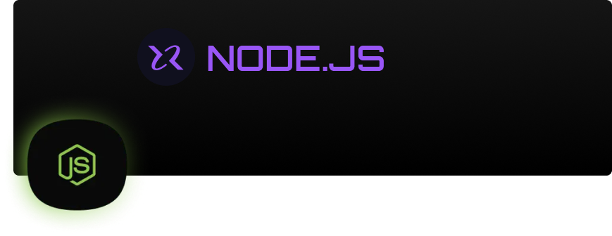

# NodeJS

  
O que é NodeJS

  É uma plataforma que utiliza <b>V8 Engine</b> para executar aplicações back-end em JavaScript no server-side.  
  Como: Envio de email, conexões a banco de dados, web sever, api, chatbots, e muito mais.  
  <a href="https://nodejs.org/en/download/"><b>Download NodeJS</b></a>
  
  Utiliza Módulos / Packages para construir aplicações.  
  NodeJS é baseado em sistema de event loops, ou seja, em eventos.  
  Internamente possui um espaço para uma pilha de funções que vão entrando.  
  NodeJS (O Boss) - É single-thred, porém possui 4 threds
  "funcionários especializados" para quem ele delega as funções.  
  Seu diferencial é separar funções simples de funções temporais e promises,
  sendo assim: Non-blocking I/O (não bloqueante), ou seja, ao delegar funções
  para seus "funcionários especializados" ele fica livre para tratar de outras
  funções.  
  ao iniciar um projeto é comum que os arquivos de configuração JS fiquem em uma pasta "src".  
  Ao iniciar um projeto com <b>node/npm</b> é criado um arquivo package.json.  
  <b>npm init -y</b> - Comando para iniciar projeto em NodeJS.  
  <b>package.json</b> - Arquivo de configuração e descrição do projeto iniciado com npm.  
  <b>scripts</b> - Responsável por executar comandos e assim executar os scripts dentro de outros arquivos.  
  <b>server.js<b> - Arquivo de configuração contendo os métodos http/Express/NextJS para criação de server e rotas do projeto.  
  <b>--watch --no-warnings<b> - Comando que permite o NodeJS monitorar alterações em arquivos e fazer um reload/reinicie o servidor express.  

 

  
Import / Export

  NodeJS aceita duas formas de importar e exportar módulos.  
  module.exports = {names_module} / require('names_module'): É o commonJS, modo como NodeJS importa e exporta módulos.  
  import / export: É o ES6Modules, modo como JS importa e exporta módulos.  
  <b>"type": "module"</b> - Opção do package.json que permite NodeJS aceitar ES6Modules.  

 

  
O que são Rotas?

  Rotas são caminho de entrada dentro da aplicação / API.  
  Cada rota possui diferentes funções e verbos HTTP para descrever determinada ação (requisição / resposta).  
  <b>GET</b> - Solicita uma informação (lista, id).  
  <b>POST</b> - Enviar dados.  
  <b>PUT</b> - Atualizar mais de um dado, deve receber um route params (rota/:id), para identificar corretamente qual dado buscar, atualizar ou deletar.  
  <b>DELETE</b> - Deletar algum dado, geralmente é referenciado por ID, deve receber um route params (rota/:id), para identificar corretamente qual dado buscar, atualizar ou deletar.  
  <b>PATCH</b> - Atualizar um único dado, deve receber um route params (rota/:id), para identificar corretamente qual dado buscar, atualizar ou deletar.  
  <b>Status Code</b> - São status code que informam o status das requisições, geralmente são formados por 3 digitos, sendo o primeiro a categria:  
  <b>100</b> - São da categora informativo (solicitação aceita, em processo, etc).  
  <b>200</b> - Sucesso (Cadastrado com sucesso, requisição ok).  
  <b>300</b> - Redirecionamento (arquivo movido, etc).  
  <b>400</b> - Erros do lado do cliente (requisição não atendida, não encontrado, etc).  
  <b>500</b> - Erro do lado do servidor (erro interno, etc).  

 

NodeJS - Possui gerenciadores de pacotes, o famoso NPM,
existe seu principal concorrente YARN.
Gerenciadores de pacotes permitem instalar e disponibilizar bibliotecas de
tercceiros de uma
forma muito simples (npm i nome_do_pacote, yarn add nome_do_pacote).

NodeJS trabalha com sistemas de módulos.
Modulos -
NodeJS possui conjuntos de modulos próprios:
FileSystem - Para leitura e escrita de arquivos.
http - Para metodos http e rotas.

Express - Framework mais utilizado no ecossistema do NodeJS,
auxilia a gerenciar servidor interno e rotas
utiliza por baixo dos panos http, módulo interno do nodeJS.

API - Aplication Programming Interface (Interface de Programação de Aplicativos)
São regras de como as aplicações podem e devem se comunicar.
Rest - Representation State Transfer (Transferência Representacional de Estado)
É um modelo de arquitetura, um padrão, ou seja ao aplicar as regras e padrões
Rest a API fica no padrão API Rest.
Rest possui 6 principais regras:
1 - Separar responsabilidades entre Cliente e Servidor
2 - Deve fornecer todas as informações como se fosse a primeiro pedido
3 - Suporte para cache
4 - Fácil identificações de recursos, representações, feedbacks.
5 - Ser construidas por camadas (segurança, recursos, etc)
6 - Ser modular

API RestFul - Ao aplicar regras como:
Utilização correta dos verbos HTTP e dos Status Code

e padrões de Rest em uma API ela é considerada
API RestFul

Por padrão os browsers só utlizam do método GET para requisições, para simular
outros métodos é necessário utilizar ferramentas como Isomnia ou Postman

Tipos de parâmetros
Route Params - São parâmetros das rotas, sua caracteristica é serem separados
por :id, servem para buscar, identificar, editar ou deletar um recurso.
uso: let params = req.params;

Query Params - São parâmetros das rotas, sua caracteristica é serem separados
por ?key=value&order=desc, servem para filtrar/paginação um recurso.
uso: let params = req.query;

Body Params - São parâmetros passados como objetos, sua caracteristica é serem
passados no corpo da requisição geralmente como JSON,
{ "name" = "Karoll", lastname = "Kym"}
servem para inserir/alterar um recurso.
uso: let body = req.body;

Middleware - São função que fica entre a requisição e resposta, geralmente utilizada para
validação de tokken, tipo de usuário.
Funções midlewares recebem 3 parâmetros (req, res, next) *parâmetro next é
responsável por dar continuidade ou não ao middleware.
Como toda função, middlewares devem ser chamados/invocados.
Middleware pode ser chamado de duas formas:
1 - Chamado como segundo parâmetro nas chamadas dos métodos das rotas, ficando
entre a rota e req, res. Podem ser adicionados mais middlewares.
*Esse modo serve para uma rota em específico
2 - Utilizand método "use( )":
server.use(função_middleware);
\*Este modo ficará disponível para todas as rotas abaixo deste "use( )".
